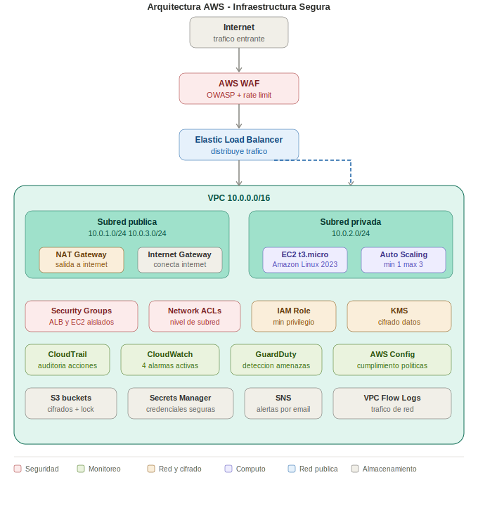

# actividad-aws-seguridad — Infraestructura Segura en AWS con Terraform

Despliegue automatizado de una aplicación web segura en AWS usando Terraform como Infraestructura como Código (IaC). Incluye red privada, balanceo de carga, escalabilidad automática, monitoreo y controles de seguridad.

**Integrantes:** Jefferson Ríos · Brayan Díaz

---

## Arquitectura desplegada



```
Internet
    │
    ▼
AWS WAF (filtra tráfico malicioso)
    │
    ▼
Elastic Load Balancer (distribuye tráfico)
    │
    ▼
┌─────────────────────────────────────┐
│           VPC 10.0.0.0/16           │
│                                     │
│  Subred Pública   Subred Privada    │
│  10.0.1.0/24      10.0.2.0/24      │
│  10.0.3.0/24      EC2 + ASG        │
│  NAT Gateway                        │
└─────────────────────────────────────┘
    │
    ▼
CloudTrail + CloudWatch + GuardDuty
(auditoría y monitoreo)
```

---

## Tecnologías

| Herramienta | Versión | Rol |
|---|---|---|
| Terraform | >= 1.5.0 | Infraestructura como código |
| AWS Provider | ~> 5.0 | Proveedor cloud |
| Amazon Linux 2023 | ami-0c421724a94bba6d6 | SO de las instancias EC2 |
| EC2 t3.micro | Free Tier | Servidor de aplicación |

---

## Estructura del repositorio

```
actividad-aws-seguridad/
├── main.tf           # VPC, subredes, NAT, EC2, ALB, Auto Scaling
├── security.tf       # Security Groups, NACLs, IAM, WAF
├── monitoring.tf     # CloudTrail, CloudWatch, SNS, GuardDuty
├── storage.tf        # S3, KMS, Secrets Manager, AWS Config
├── variables.tf      # Definición de variables
├── terraform.tfvars  # Valores concretos del proyecto
├── outputs.tf        # Outputs: IPs, ARNs, URLs
└── devops-key.pub    # Clave pública SSH (debes generarla)
```

---

## Prerrequisitos

### 1. Herramientas requeridas

```bash
# Verificar instalaciones
terraform version    # >= 1.5.0
aws --version        # AWS CLI v2
ssh-keygen --help    # incluido en Git Bash / Linux / Mac
```

**Instalar Terraform en Windows:**
```powershell
winget install HashiCorp.Terraform
```

**Instalar AWS CLI en Windows:**
```powershell
winget install Amazon.AWSCLI
```

### 2. Cuenta AWS

- Registrarse en https://aws.amazon.com/free (Free Tier)
- Activar MFA en la cuenta raíz desde la consola AWS
- Crear usuario IAM con política `AdministratorAccess`
- Descargar las credenciales (.csv) al crear el usuario

### 3. Configurar credenciales AWS

```bash
aws configure set aws_access_key_id TU_ACCESS_KEY_ID
aws configure set aws_secret_access_key TU_SECRET_ACCESS_KEY
aws configure set region us-east-1
aws configure set output json

# Verificar
aws sts get-caller-identity
```

### 4. Generar par de claves SSH

```bash
# Ejecutar en la carpeta del proyecto
ssh-keygen -t rsa -b 4096 -f devops-key -N ""
# Genera: devops-key (privada) y devops-key.pub (pública)
# El archivo devops-key.pub es el que usa Terraform
```

> ⚠️ Nunca subas `devops-key` (clave privada) al repositorio. Agrega al `.gitignore`:
> ```
> devops-key
> *.tfstate
> *.tfstate.backup
> .terraform/
> ```

---

## Configuración previa al despliegue

Edita `terraform.tfvars` con tus valores:

```hcl
project_name  = "devops-seguridad"
environment   = "produccion"
region        = "us-east-1"

instance_type = "t3.micro"        # Free Tier eligible
key_pair_name = "devops-key"

asg_min_size         = 1
asg_max_size         = 3
asg_desired_capacity = 1

alert_email = "tu-email-real@dominio.com"   # CAMBIAR
```

### Obtener la AMI correcta para tu cuenta

La AMI varía según la cuenta y región. Obtén la correcta ejecutando:

```bash
aws ec2 describe-images \
  --owners amazon \
  --filters "Name=name,Values=al2023-ami-2023*-kernel-*-x86_64" \
             "Name=state,Values=available" \
             "Name=architecture,Values=x86_64" \
  --query "sort_by(Images, &CreationDate)[-1].ImageId" \
  --output text
```

Copia el resultado y actualiza en `variables.tf`:
```hcl
variable "ami_id" {
  default = "ami-XXXXXXXXXXXXXXXXX"   # pegar aquí el resultado
}
```

---

## Despliegue

```bash
# 1. Inicializar Terraform (descarga providers)
terraform init

# 2. Previsualizar cambios sin aplicar
terraform plan

# 3. Aplicar la infraestructura
terraform apply -auto-approve

# 4. Ver los recursos creados
terraform output
```

**Output esperado:**
```
alb_dns_name      = "devops-seguridad-alb-XXXXXXXXX.us-east-1.elb.amazonaws.com"
cloudtrail_bucket = "devops-seguridad-cloudtrail-logs-XXXXXXXXXXXX"
ec2_instance_id   = "i-XXXXXXXXXXXXXXXXX"
kms_key_arn       = "arn:aws:kms:us-east-1:XXXXXXXXXXXX:key/XXXXXXXX-..."
sns_topic_arn     = "arn:aws:sns:us-east-1:XXXXXXXXXXXX:devops-seguridad-alerts"
vpc_id            = "vpc-XXXXXXXXXXXXXXXXX"
waf_acl_arn       = "arn:aws:wafv2:us-east-1:XXXXXXXXXXXX:regional/webacl/..."
```

---

## Descripción técnica de cada recurso

### Red (main.tf)

**`aws_vpc`** — Red virtual privada con CIDR `10.0.0.0/16`. Aísla completamente la infraestructura del resto de AWS. Tiene DNS habilitado para resolución interna de nombres.

**`aws_subnet` (pública x2)** — Subredes en `us-east-1a` y `us-east-1b` para el ALB. El ELB requiere mínimo dos zonas de disponibilidad para garantizar alta disponibilidad.

**`aws_subnet` (privada)** — Subred `10.0.2.0/24` donde viven las instancias EC2. No tiene ruta directa a internet — el tráfico sale únicamente a través del NAT Gateway.

**`aws_internet_gateway`** — Puerta de enlace que conecta las subredes públicas con internet. Las subredes privadas no tienen acceso directo a este gateway.

**`aws_nat_gateway`** — Permite a las instancias en la subred privada hacer peticiones salientes (actualizaciones, descargas) sin exponer sus IPs a internet. Se ubica en la subred pública y usa una IP elástica dedicada.

**`aws_flow_log`** — Registra todo el tráfico de red de la VPC en CloudWatch Logs. Permite analizar patrones de tráfico y detectar comunicaciones sospechosas.

**`aws_instance`** — Instancia EC2 `t3.micro` con Amazon Linux 2023, desplegada en la subred privada. Tiene disco cifrado de 30GB y un rol IAM con mínimos privilegios. Arranca con Apache httpd mediante `user_data`.

**`aws_lb`** — Application Load Balancer público que recibe el tráfico en el puerto 80 y lo distribuye entre las instancias del Auto Scaling Group mediante round-robin.

**`aws_autoscaling_group`** — Grupo de escalado que mantiene entre 1 y 3 instancias según la demanda. Escala automáticamente cuando la CPU supera el 70%.

---

### Seguridad (security.tf)

**`aws_security_group` (ALB)** — Firewall del Load Balancer. Acepta tráfico HTTP/HTTPS desde cualquier IP pero solo reenvía al puerto 80 de las instancias EC2.

**`aws_security_group` (EC2)** — Firewall de las instancias. Solo acepta tráfico HTTP proveniente del Security Group del ALB — las instancias no son accesibles directamente desde internet.

**`aws_network_acl`** — Capa adicional de seguridad a nivel de subred privada. Bloquea todo el tráfico entrante excepto HTTP interno y SSH desde dentro de la VPC.

**`aws_iam_role` (EC2)** — Rol con permisos mínimos para las instancias: acceso a SSM (gestión sin SSH) y escritura en CloudWatch Logs. Implementa el principio de menor privilegio.

**`aws_wafv2_web_acl`** — Web Application Firewall con tres capas de protección: reglas OWASP Top 10 contra inyección SQL y XSS, bloqueo de inputs maliciosos conocidos, y rate limiting de 1000 peticiones por IP cada 5 minutos.

**`aws_shield_protection`** — Shield Standard activo automáticamente en toda cuenta AWS. Protege contra ataques DDoS volumétricos sin costo adicional.

---

### Monitoreo (monitoring.tf)

**`aws_cloudtrail`** — Registra todas las acciones realizadas en la cuenta AWS: quién hizo qué, cuándo y desde dónde. Cubre todas las regiones, valida integridad de logs y los almacena en S3 con retención de 90 días.

**`aws_cloudwatch_metric_alarm` (CPU)** — Dispara alerta por SNS cuando el CPU de las instancias supera el 80% durante 4 minutos consecutivos.

**`aws_cloudwatch_metric_alarm` (4xx)** — Detecta más de 50 errores HTTP 4xx en 1 minuto — señal de posible escaneo o ataque de fuerza bruta contra la aplicación.

**`aws_cloudwatch_metric_alarm` (logins)** — Alerta cuando se detectan más de 5 intentos de login fallidos en 5 minutos — indicador de ataque de fuerza bruta.

**`aws_cloudwatch_metric_alarm` (SG changes)** — Notifica cualquier modificación en los Security Groups — cambios no autorizados en las reglas de firewall son una señal de alerta crítica.

**`aws_cloudwatch_log_metric_filter`** — Filtra los logs de CloudTrail para extraer eventos específicos de seguridad y convertirlos en métricas medibles por CloudWatch.

**`aws_sns_topic`** — Canal de notificaciones que envía alertas por email cuando se dispara cualquier alarma de CloudWatch.

**`aws_guardduty_detector`** — Servicio de detección inteligente de amenazas que analiza logs de VPC, CloudTrail y DNS para identificar comportamientos anómalos como accesos desde IPs maliciosas o minería de criptomonedas.

---

### Almacenamiento y datos (storage.tf)

**`aws_kms_key`** — Clave de cifrado gestionada por el cliente con rotación anual automática. Cifra datos en S3, discos EC2 y secretos en Secrets Manager.

**`aws_s3_bucket` (app)** — Bucket para datos de la aplicación con acceso público completamente bloqueado, cifrado KMS, versionamiento habilitado y Object Lock en modo GOVERNANCE — protege los datos contra eliminación accidental o maliciosa por 30 días.

**`aws_secretsmanager_secret`** — Almacena credenciales de base de datos cifradas con KMS. Las instancias EC2 acceden a estas credenciales mediante el rol IAM, sin necesidad de hardcodear contraseñas en el código.

**`aws_config_configuration_recorder`** — Registra el historial de configuración de todos los recursos AWS. Permite ver el estado de cualquier recurso en cualquier momento del pasado.

**`aws_config_config_rule`** — Dos reglas de cumplimiento automático: verifica que los volúmenes EC2 estén cifrados y que los buckets S3 no sean públicos. Marca como no conformes los recursos que violen estas políticas.

---

## Destruir la infraestructura

Para evitar cargos inesperados al terminar la actividad:

```bash
terraform destroy -auto-approve
```

> ⚠️ El NAT Gateway genera costos por hora (~$0.045/hora). Destruye la infraestructura cuando no la estés usando.

---

## Solución de problemas comunes

| Error | Causa | Solución |
|---|---|---|
| `InvalidParameterCombination: not eligible for Free Tier` | AMI incompatible con el tipo de instancia | Ejecutar el comando de búsqueda de AMI y actualizar `variables.tf` |
| `ResourceAlreadyExistsException` | Recurso huérfano de ejecución anterior | `terraform import RECURSO ID` |
| `AlreadyExists: AutoScalingGroup` | ASG no eliminado correctamente | `terraform import aws_autoscaling_group.app NOMBRE-ASG` |
| `scheduled for deletion` (Secrets Manager) | Secreto en período de retención | `aws secretsmanager delete-secret --force-delete-without-recovery` |
| Import falla con ruta de Windows | Git Bash interpreta `/` como ruta local | Usar PowerShell para el comando `terraform import` |
